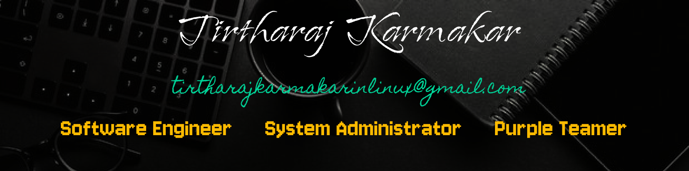

  

<h1 align="center">Tirtharaj Karmakar</h1>
<h3 align="center">Software Developer | Systems & Network Programming | Full-Stack Enthusiast</h3>

---

## About Me
I am a **Software Developer** with experience in building reliable, efficient and scalable software systems.  
My work spans **system programming, networking, cross-platform apps, and full-stack development**, with a strong focus on **performance, robustness, and security**.

- Currently exploring **systems programming, networking, and cybersecurity**
- Hands-on experience with **C/C++, Flutter, Electron, and Next.js**
- Strong foundation in **data structures, operating systems, and TCP/IP**
- Open to collaboration on **system tools and real-world applications**

---

## Connect With Me

&nbsp;

&nbsp;

---

## Technical Skills

---
## 📦 My Repositories

Here’s a curated list of my public repositories with descriptions:

### 💻 Applications & Projects
- **student-management-system** – Java based student management system.  
- **google-maps-scrapper** – Python scraper for collecting business contact info from Google Maps.  
- **zipbomb** – PowerShell project demonstrating ZIP bomb behavior.  
- **pern-todo** – A TODO API built using PERN (PostgreSQL, Express, React, Node).  
- **modern-computer-renewed** – Official website source for *Modern Computer*.  
- **HTTP-Server** – A minimal HTTP server in C using *libmicrohttpd*.  
- **Weather-App** – CLI weather app in C with a simple and minimal UI.

### 🔍 Utilities & Scripts
- **asset-discovery** – C tool for local network asset discovery using ARP cache.  
- **Product-Scrapper** – Python script to scrape product data.  
- **StudentDataGenerator** – Java + PostgreSQL scalable student data generator.

### 🧠 Machine Learning / CV
- **FaceDetection** – Python project for face detection using OpenCV.

### 🧠 Frontend & UI
- **mindmap** – Simple Mind Map web app with Next.js + Supabase.  
- **stopwatch-app** – Stopwatch app in Dart (Flutter).  
- **portfolio_final** – Personal portfolio built with Flutter.

### 🛠️ Misc & Hardware
- **school-management** – TypeScript based school management UI project.  
- **Hackintosh_Screenshots** – Screenshots & notes from Hackintosh setup.  
- **Digispark** – C++ code examples for the Digispark ATTINY85 board with Arduino IDE.

---

## GitHub Statistics

---

## Education
**Bachelor of Science in Computer Science**  
*University of Calcutta*  
(ongoing)

---

## Languages
- Bengali — Native  
- Hindi — Advanced  
- English — Proficient  

---

⭐ *If you like my projects, feel free to star them — it keeps me motivated!*
